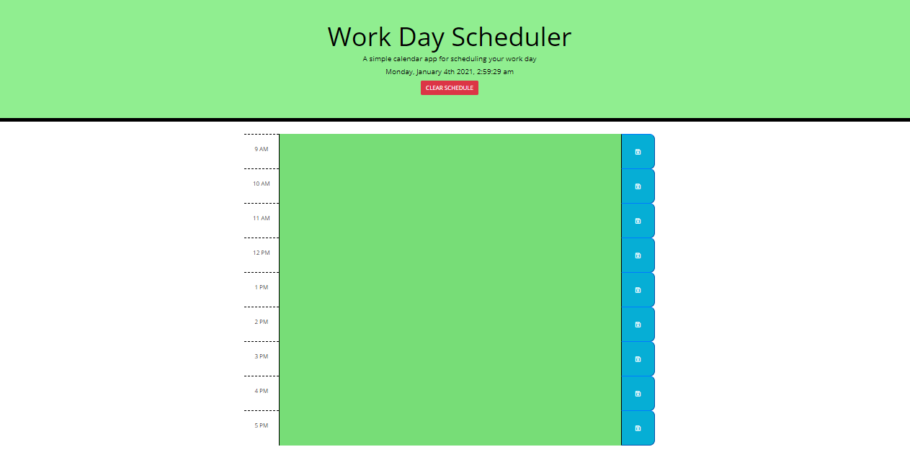

# Work Day Scheduler
----------------------
## Description

Application is an event planner for the day. Planner will reset every day or upon clicking the clear button.

## Prerequisites

None

## Technologies Used

- HTML
- CSS
- Javascript

## APIs Used

- JQuery
- Moment.js

## Website Appearance




## Deployed Link
https://weilibryan.github.io/Daily-Planner/

## Code Snippet
```
// Decides what color blocks are based on time
function blockColor(now) {
    var hour = now.format('HH');

    // For loop decides what color blocks are
    for (var k=0; k<9; k++) {

        // if the current hour is equal to the data value of time then set class to present
        if (hour == $('#' + k).attr('data-time')) {
            $('#' + k).removeClass("past present future");
            $('#' + k).addClass("present");
        }

        // If current hour is past data attribute then set class to past
        else if (hour > $('#' + k).attr('data-time')){
            $('#' + k).removeClass("past present future");
            $('#' + k).addClass("past");
        }

        // If current hour is before data attribute then set class to future
        else {
            $('#' + k).removeClass("past present future");
            $('#' + k).addClass("future");
        }
    }
}
```

## Authors

1. **William W. Bryan** 
- [Github](https://github.com/WeiLiBryan)
- [LinkedIn](https://www.linkedin.com/in/william-bryan-72730019a/)


## License

This project is licensed under the MIT License


## ACKNOWLEDGEMENTS

- [Stack Overflow](https://stackoverflow.com)

- [Moment.js](https://momentjs.com/)

- [Jquery](https://jquery.com/)
